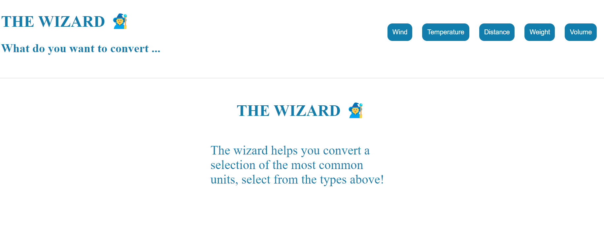
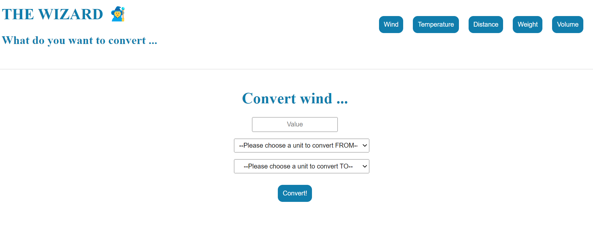
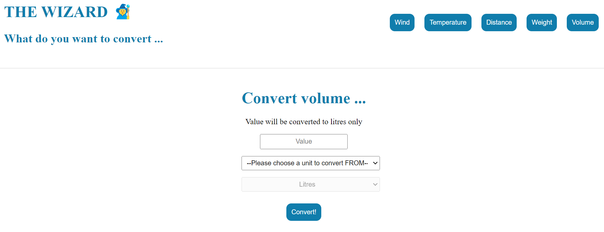
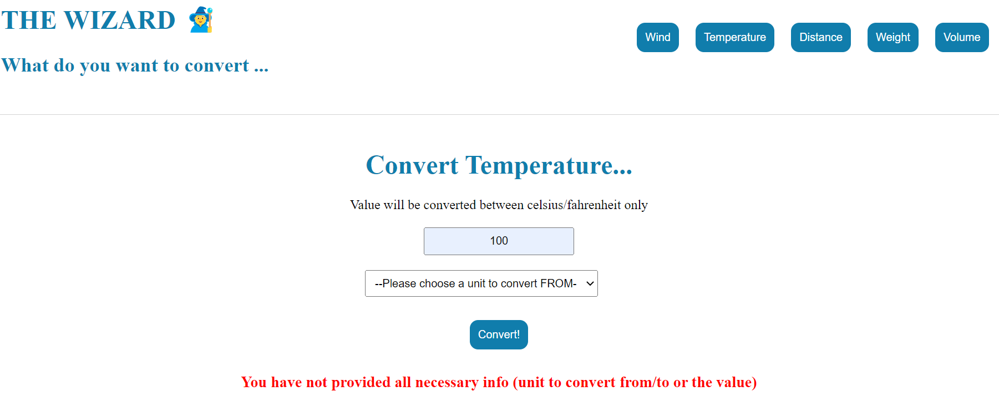

# The Wizard Application

## App Instructions

### Getting started

* Navigate in terminal window to a folder of your choice on your local computer
* Run: git clone https://github.com/AndreaViolaCaroline/1dv610-assignment-L2.git
* Make sure you have navigated to the folder containing package.json
* Run: npm install
* Run npm run dev
* Now you can press ctrl and click the link from Vite and view the app on localhost

#### Screen shots from The Wizard App

### Getting around

By pressing the buttons representing different types of measurement units (Wind, Temperature etc) you will be presented a page where you have dropdown lists of the units that are available for conversion. 

Select which, fill out a value and press convert. The new value will be presented or, if something went wrong you will have an informative message displayed on the screen. See examples below.

