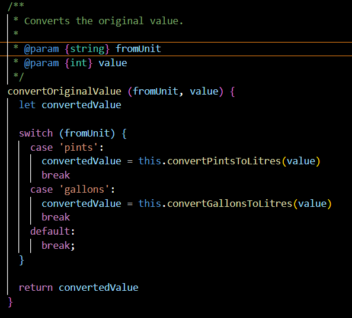
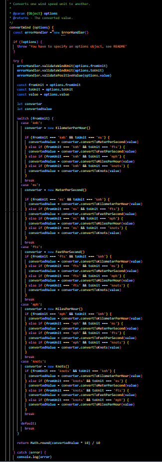
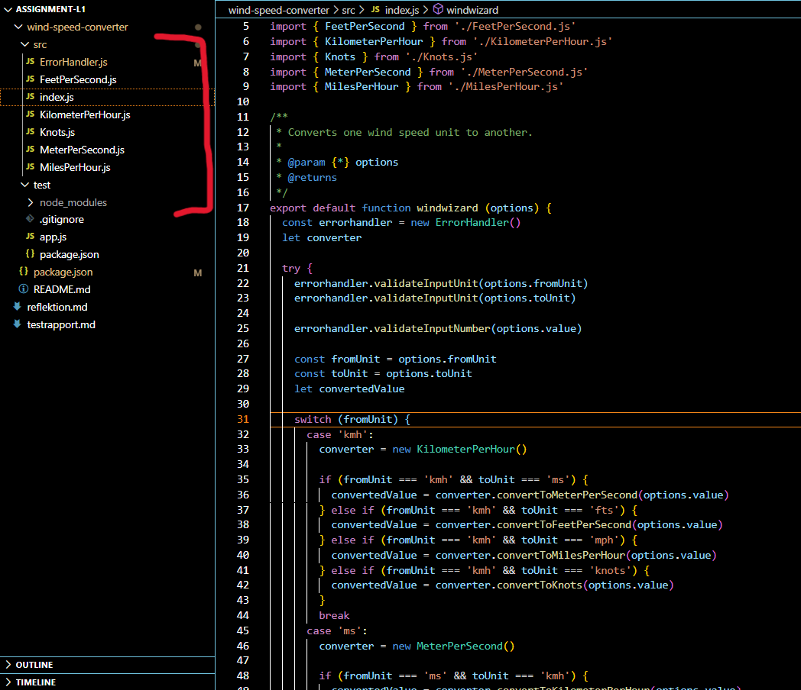
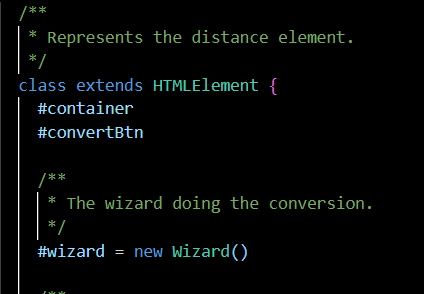
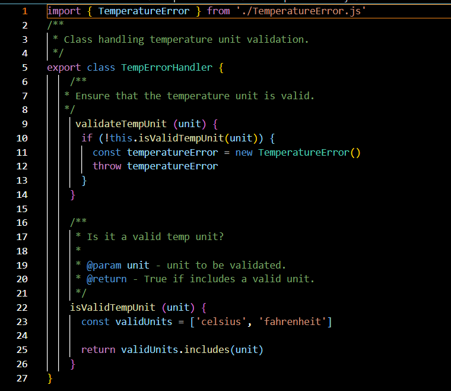

# Reflection

##  Navigate easier Daniel!

### L1
* DEVELOPER.md https://github.com/AndreaViolaCaroline/1dv610-assignment-L1/blob/main/DEVELOPER.md
* README.md https://github.com/AndreaViolaCaroline/1dv610-assignment-L1/blob/main/README.md

### L2
* DEVELOPER.md https://github.com/AndreaViolaCaroline/1dv610-assignment-L2/blob/main/DEVELOPER.md
* README.md https://github.com/AndreaViolaCaroline/1dv610-assignment-L2/blob/main/README.md

## Feedback from Workshop 2 (on the Wizard package)

The Wizard package: https://github.com/AndreaViolaCaroline/1dv610-assignment-L1

* Break out all of the if statements in index file to increase readability and maintainability.
* Create another file structure i.e create a folder per measurement unit (wind, temperature, distance etc)

## Overview - What has changed in the Wizard package?

The Wizard package: https://github.com/AndreaViolaCaroline/1dv610-assignment-L1

* I broke out all of those if statements into functions in a lower abstraction layer closer to where the algorithms for a certain type of conversion is located - avoiding feature envy (Robert C Martin, Clean Code, p.293)
* I structured the project as such that instead of having all files loose in the src folder, files now belong to a certain measurement unit folder that contains the algorithms and the converter. I also put all the error handling into a seperate folder with one generic error handling file as well as error handling specific on each measurement unit (since the package converts only a selection of units) - improving cohesion (Robert C Martin, Clean Code, p.140)
* The longest method has therefor decreased from 90 to 37 rows
* The biggest class was reduced from 262 rows to 80
* I ran into a rather interesting problem whilst refactoring my package - I have by now written a few apps and I have used a few libraries - the question that arose: "What the heck - I try AND catch errors in here (as in within the package) - is that the right way to go about it? If I catch it, then what can the user of the library actually do to handle an error as he/she wishes?" I'm not even sure this is avalid concern or if I am just complicating things. However, I googled a tiny bit and in the end I decided, my library will ONLY throw errors and then I will inform lib-users on what errors to expect and how to catch them.

## Reflections per chapter in Clean Code

Overall, I feel like I have managed to reduce sizes of classes/methods and maybe place them more logically clean within folders. I do feel though (this becomes extra clear in my first reflection on chapter 2) that my package is "deeper" and that I have methods in several classes that really does/is called the same thing but with something extra happening on top. E.g the convertedValue travels from the lowest abstraction where the algortihm is chosen, then on the next level there is errorhandling making sure that all values needed to the conversion is in place and then there is the highest layer which is the package interface - my thoughts are, if this is good or not..?

### Chapter 2

Looking at this method in my package, I can find that it does two things really, such methods are hard to give a meaningful and clear name. 1. It selects the correct algorithm 2. It actually converts and returns the value. I chose to name it after the most important thing it does i.e converts the original value, but Im thinking it could possibly be changed to getCorrectAlgorithm, beacause higher in the abstraction I am using this method in another method that is called convertValue.. The name per see is clear, but is it really describing what the method does..?

### Chapter 3

This was my biggest method, it was in the package interface (I know you wanted to be able to read the screen shots, but in this case it is not the point, look how long it is..):

"There's just too much going on there on different levels of abstraction" (Robert C Martin, Clean Code, p.33).

If I feel like I managed to do something good during my refactoring it is that I made all classes and methods smaller!
"The first rule of functions is that they should be small. The second rule of functions is that they should be smaller than that" (Robert C Martin, Clean Code, p.34).

After transforming my package basically pushing all that selective type code to lower abstracted classes this is how it turned out:

### Chapter 4

This is from my Wizard App, L2. I started out by religously commenting on each tiny little element I could - I believe this is something that we did in year one whilst writing web components. "What purpose does this comment serve? It’s certainly not more informative than the
code. It does not justify the code, or provide intent or rationale." (Robert C Martin, Clean Code, p.61) I have to agree with CC - I got annoyed typing them and I also got annoyed reading them (they are removed). 

### Chapter 5

Vertical formatting was probably the most important refactoring that I performed on my lib. "Small files are usually easier to understand than large files are." (Robert C Martin, Clean Code, p.108). You can see it in the following two screenshots, the difference in the file structure, the aftermath was folders containing files that held the algorithms as well as another file being responsible for the conversion and error handling. Meaning, formatting also improves cohesiveness! I have also followed the NewsPaper metaphor with the higher level abstraction up top.

"If openness separates concepts, then vertical density implies close association." (Robert C Martin, Clean Code, p.108). In the following photo you can see a group of "class members" (web component style). The two up top are generic elements that I use to grab data from the view - they are placed closely. Then I create some spacing and place the wizard that does the calculation.

### Chapter 6

I feel as through my code in this case I find it hard to draw a concrete example, but - "The method should not invoke methods on objects that are returned by any of the allowed functions. In other words, talk to friends, not to strangers." Basically I have three layers of abstraction by now (low: get the algorithm and convert, middle: validate user input, high: get user input). However I am not seeing any "trainwrecks". I consider my middle layer the helping hand in this. It gets some input and validates it, then calls its lower friend to change the input, gets something back and then gives that to the higher level. Meaning the higher and the lower layer never speak they are "strangers" and they only speak with their one common friend, middle.

### Chapter 7

"Use exceptions rather than return codes", "Each exception that you throw should provide enough context to determine the source and
location of an error" and the old goodie "Error handling is one thing!". This chapter helped me solve (I think) what I mentioned as a problem above in the overview. First of all I placed error handling in seperate error handlers depending on what measurement unit it should handle. Then I chose to define exceptions classes, and my errors now provide a context - the library now throws errors that are of specific types and the documentation informs library users about it!

### Chapter 8

Clean boundaries i.e separating others code from the code I write. The book states: "There is a natural tension between the provider of an interface and the user of an interface." (Robert C Martin, Clean Code, p.114). Now after building my own "third-party-library" I realize that one way to avoid bad experiences from mixed in libraries are the communication about ones library! I have worked really hard on the readme for my lib as to avoid people ending up missunderstanding it and using it the wrong way! Code examples and informative descriptions of how the library acts (for example throws error) will set any user up for an easier intergration of the library.

### Chapter 9

I need to improve here in the sense that I only test manually, simply because I dont know how to write automatic test cases. It's clear and obvious to me that test code should follow the same guide lines as production code and be of high quality. I find it a bit hard to resonate with the chapter personally since I have not written automatic tests like that, but one thing that I am all here for is test driven development, it makes me fear less as the book mentions and I also control the way I build my app. I mean I don't just start a little bit here a little bit there and not test if I'm on the right track - tests make me want to slow down and methodically build a good piece of software, I start in one corner, test a little, code a little, test again and then when that part is more or less fully funtioning I move on to the next.

### Chapter 10

The SRP or the Single Responsibility Principle was definitely something that improved when I started yanking parts of my code out from one place and designated it another! It amazes me that I at first did not see that my classes were big, you can really stare yourself blind which explains why this principle is the most abused one in OOP. Now, in my package, all measurment units has their own converter class and their own error handler. One thing that crossed my mind though, as a worry, was that I feel like there is duplicated code, don't get me wrong this was still there before, at leat now its more organized and I mean, I think my subject is a bit repetetive to start? As in, conversion is really the same idea - the only thing that changes are the units and the algorithms, but to then be able to validate them I need their specific method to do this, now they are encapsulated in a certain class rather than a loose hanging "do-it-all-handler"

### Chapter 11

"The power of separating concerns through aspect-like approaches can’t be overstated." (Robert C Martin, Clean Code, p.166). This is what I have tried to to be making my library "deeper". I feel like I can describe my application as a checkered net which makes me think of cross-cutting concerns that the book mentions. Horizontally I have my lower, middle and higher abstraction layers stacked and vertically I have my domain reaching their specific "inner part" of the lib which I believe resonates with the fact that some concerns "tend to cut across natural object boundaries of a domain." (Robert C Martin, Clean Code, p.160)

